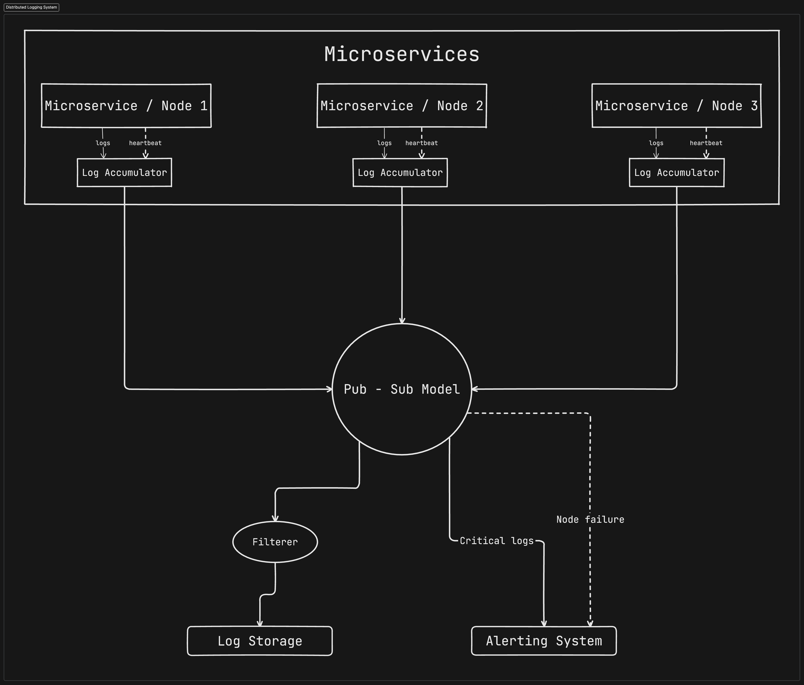

# Distributed Logging System using Kafka, Fluentd and ElasticSearch database storage

This project aims to streamline the collection and storage of logs from several different microservices 

## System Architecture

To run fluent open 3 instances fluent package command line with admin permission 

start the fluent service :
    fluentd start fluentdwinsvc

then on each instace
    fluentd -c "path to the conf file"

To check elasticsearch index logs using curl command
curl -X GET "http://localhost:9200/db_name/_search?pretty=true" -H 'Content-Type: application/json' -d '{
  "size": 1,
  "query": {
    "match_all": {}
  }
}

To delete index to clear the logs
curl -X DELETE http://localhost:9200/db_name